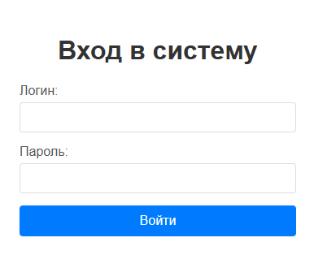
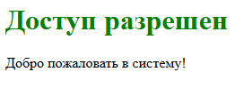
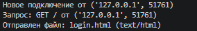

# Практическая работа 5: Реализация простейшего Web-сервера и обработка форм (HTTP)

---
**Дисциплина:** Распределенные системы\
**Выполнил:** Верещак Д.Д\
**Группа:** 23-ПИ-01\
**Преподаватель:** Алешин Александр Владимирович

---
## Описание проекта
Данный проект реализует простейший многопоточный HTTP-сервер на Python с нуля, который слушает 8080 порт и обрабатывает HTTP-сообщения, отдачу статического контента, т.е HTML-страница с формой и обработку POST-запроса с данными авторизации.

---
## Цель работы
Понять принцип работы протокола HHTP "изнутри", реализовав базовый веб-сервер на сокетах без использования фреймворков (Flask или Django).

```
├── Server.py          # Серверная часть
├── Login.html         # Форма для заполнения данных для входа
├── screenshots.       # Папка для скриншотов
```

---
## Технологический стек

- **Python 3.10+**
- **HTTP-протокол (прикладной уровень модели OSI)**
- **TCP-сокеты (stream sockets)**
- **Многопоточный режим работы (_thread / threading)**
- **Ручной парсинг HTTP-запросов (без встроенных парсеров)**
- **Ручное формирование HTTP-ответов**
- **Маршрутизация по методу (GET/POST) и URI-пути**
- **Базовая аутентификация (логин/пароль)**
- **Статусные коды HTTP: 200, 403, 404, 405, 500**
- **MIME-типы (Content-Type: text/html, text/css, image/jpeg и др.)**
- **Заголовки HTTP: Content-Type, Content-Length, Connection**
- **Формы HTML (method="POST", action="/login")**
- **Кодировка UTF-8**
- **Хост: localhost (127.0.0.1)**
- **Порт: 8080 (альтернатива — 80)**
- **Библиотеки: socket, _thread (или threading), urllib.parse, os, mimetypes**

---
## Инструкция по запуску
**Шаг 1: Проверка установленной версии Python**

**Откройте терминал (командную строку) и выполните:**
```
python --version
```
**Шаг 2: Запуск сервера**
1. Откройте первый терминал
2. Перейдите в папку с проектом
3. Запустите сервер:
```
python Server.py
```
Сервер перейдет в режим ожидания подключения:
```
Сервер запущен на http://localhost:8080
Учетные данные: admin / 12345
Ожидание подключений... (Ctrl+C для остановки)
```

**Шаг 3: Запуск сайта**
1. Откройте адресную строку
2. Введите "http://localhost:8080"
3. Нажмите "Enter"

В результате у вас будет открыта форма для заполнения данных о пользователе



**Шаг 4: Ввод данных**

**Введите данные в поля "Логин" и "Пароль**

При вводе admin и 12345 будет написано, что доступ разрешен и в терминале будет написано, что произошло подключение.





В случае неверного ввода данных - ошибка.


